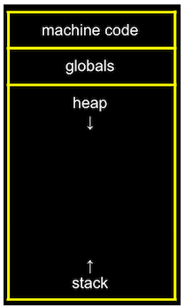

최초작성일: 2023-02-19
마지막 수정일: 2023-02-25

부스트코스 <모두를 위한 컴퓨터 과학 (CS50 2019)> 강의 수강

<br/>

# 5. 메모리

## 1. 메모리 주소

- 16진법을 읽고 쓸 수 있다.
- 메모리 주소에 접근하고 값을 받아오는 코드를 C로 작성할 수 있다.
- 16진법, 메모리 주소

<br/>

- 진법 - 컴퓨터나 휴대폰 속 메모리의 위치를 표현하는 데 매우 유용.
- 각 바이트에 고유한 숫자를 부여하여 메모리 속 내용물에 대해 이야기할 수 있다.

<br/>

### 16진법(Hexadecimal)

- 컴퓨터가 숫자를 16진법으로 표현하는 경우가 많다.
- 16진수를 사용하면 10진수보다 2진수를 간단하게 나타낼 수 있다.
- 0 ~ 9, A ~ F: F는 15
- 8bit 이진법으로 나타낼 수 있는 최대 수는 255(11111111): 16진법으로는 FF
    - 4bits씩 두 덩어리로 나누어 16진수로 표현 가능
- 다른 숫자 표현과 헷갈리지 않도록 숫자 앞에 `0x`를 붙임
    - 0x8, 0x1F, ...

#### 16진수의 유용성

- 2진수로 표현했을 때보다 간단해짐.
- 컴퓨터는 8개의 비트가 모인 바이트 단위로 정보를 표현하는데, 2개의 16진수는 1바이트의 2진수로 변환되기 때문에 정보를 표현하기 매우 유용

#### RGB

- 컴퓨터는 빨간색, 초록색, 파란색으로 색을 표현
- 16진법으로 각 색의 양을 나타내도록 정한 것
- `000000`: 검은색
- `FF0000`: 빨간색
- `FFFFFF`: 흰색

### 메모리 주소

```c
#include <stdio.h>

int main(void)
{
    int n = 50;
    printf("%i\n", n);
}
```

- 메모리 어딘가에 변수 n이 저장. int는 4bytes

```c
#include <stdio.h>

int main(void)
{
    int n = 50;
    printf("%p\n", &n);     // &: ~의 주소를 의미하는 연산자. %p가 주소를 출력해줌
}

// 0x7ffdee62027c
```

- n이 저장되어있는 위치(메모리상 주소)를 알 수 있음.
- `포인터`: 컴퓨터 메모리의 주소를 가리키는 것. `%p`
- `printf`로 포인터를 출력해달라고 하면 16진수로 출력해 줌.
- `&n`: 'n의 주소를 달라'
- `*`: 그 주소로 가 달라

```c
#include <stdio.h>

int main(void)
{
    int n = 50;
    printf("%i\n", *&n);     // *: 그 주소로 가달라
}

// 50
```

- 변수의 자료형을 모른다면 어떤 형식 지정자를 사용해야 할까?
    - 직접 결정해야.
    - 추정하거나 뭐든 알려줘야.
    - c에서 자료형을 알려주는 기능은 없음.

<br/>

## 2. 포인터

- 포인터 변수를 정의하고 사용할 수 있다.

<br/>

### 포인터 변수 정의

```c
#include <stdio.h>

int main(void)
{
    int n = 50;
    int *p = &n;    //포인터는 앞에 *을 붙여 표시. int는 포인터가 가리키는 값의 자료형
    printf("%p\n", p);
    printf("%i\n", *p);
}

// 0x7ffc3aa393ac
// 50
```

- n의 주소를 p에 저장. p는 int를 가리키는 포인터.
- 주소는 반드시 포인터에 저장해야. 그냥 `int p = &n;` 해버리면 컴파일러가 경고.
    - int형에 주소를 저장할 수 없다.
- 최신 컴퓨터는 64bits(8bytes) 포인터를 사용

<br/>

- 포인터는 추상화를 위해 사용됨
- 우리는 주소 자체가 궁금한 게 아니라 그 위치에 접근하고 싶은 것.
- 포인터를 이용해 p가 50을 가리킨다는 개념을 표현.

<br/>

- 정수 50은 정수형 변수 안에 존재. 주소는 포인터 변수 p 안에 존재.
- 개념적으로는 p라는 변수가 다른 변수를 가리키는 것.
- 이를 이용해 정교한 자료형을 만들 수 있다.

<br/>

## 3. 문자열

- 문자열 형태의 새로운 자료형인 string이 어떻게 정의되었는지 설명할 수 있다.
- 포인터, 문자열

### c에는 문자열 자료형이 없다

- 각 바이트는 고유의 주소를 갖고 있다.
- `string s = "EMMA"`
- s는 포인터로 메모리에 있는 EMMA의 첫 글자를 가리킨다.
- 컴퓨터는 문자열의 첫 번째 글자를 가리키면 널 종단 문자를 만날 때까지 루프를 돌면서 끝을 알아냄
- c에는 '문자열(string)'이라는 건 없음
- 문자열: 포인터. 첫번째 문자의 주소를 가리키면 그게 문자열

<br/>

```c
string s = "EMMA";
char *s = "EMMA";       // 문자를 가리키는 주소 저장
```
- cs50 라이브러리에서 새로운 자료형을 정의했던 것
- 문자열: 문자 배열의 첫 번째 바이트 주소

<br/>

- 실제 cs50 라이브러리에서 문자열을 정의한 방식

    ```c
    typedef char *string;       // typedef 새로운 자료형을 정의한다
                                // 'char *' 이 값의 형태가 문자의 주소가 될 것이다
                                // 데이터타입의 이름은 string으로
    ```

<br/>

```c
#include <stdio.h>

int main(void)
{
    char *s = "EMMA";
    printf("%s\n", s);
    printf("%p\n", s);
    printf("%p\n", &s[0]);
    printf("%p\n", &s[1]);
    printf("%p\n", &s[2]);
    printf("%p\n", &s[3]);
}

// EMMA
// 0x402004
// 0x402004
// 0x402005
// 0x402006
// 0x402007
```

- 문자열은 여러 문자의 묶음을 추상화한 것
- 실제 변수 s는 그냥 주소

<br/>

## 4. 문자열 비교

- 문자열이 저장되어 있는 방식에 근거해서 문자열을 비교하는 방법에 대해 설명할 수 있다.
- 문자열

<br/>

```c
#include <stdio.h>

int main(void)
{
    char *s = "EMMA";
    printf("%c\n", *s);     // *s: s라는 주소로 가달라
    printf("%c\n", *(s+1));
    printf("%c\n", *(s+2));
    printf("%c\n", *(s+3));
}

// E
// M
// M
// A
```

- `Syntactic sugar`: 프로그래머에게 유용한 기능
    - s[0], s[1] 등의 대괄호 표현식으로 적으면 컴퓨터 내부에서 clang 컴파일러가 대괄호 표현식을 위의 형태로 바꿔준다.
- s를 출력하면 전체 문자열이 출력되는 이유?
    - `%s` 형식 지정자에 의해 그 주소로 가서 첫 글자만이 아니라 널 종단 문자를 만날 때까지 다음 문자를 계속 출력해주는 것

### 포인터 연산(Pointer Arithmetic)

*주소를 가져와서 1, 2, 3을 더하는 것처럼 계산하는 것*

### 비교

#### 정수 비교

```c
#include <cs50.h>
#include <stdio.h>

int main(void)
{
    int i = get_int("i: ");
    int j = get_int("j: ");

    if (i == j)
    {
        printf("Same\n");
    }
    else
    {
        printf("Different\n");
    }
}
// i: 5
// j: 5
// Same
```

#### 문자열 비교

```c
#include <cs50.h>
#include <stdio.h>

int main(void)
{
    string s = get_string("s: ");
    string t = get_string("t: ");

    if (s == t)
    {
        printf("Same\n");
    }
    else
    {
        printf("Different\n");
    }
}

// s: Emma
// t: Emma
// Different // 다른 곳에 저장되어 있어서
```

- s와 t가 다른 곳에 저장되어 있기 때문
- 내용이 같을 수는 있지만 같은 곳에 있다는 의미는 아님
- 문자열을 비교하면 `변수의 주소`를 비교하게 되는 것

<br/>

- CS50 라이브러리의 `get_string` 함수는 첫 글자의 주소를 반환하는 함수
- 메모리 공간에서 입력한 문자 크기만큼의 공간을 찾아 입력한 글자를 넣어두고 메모리 공간의 첫 바이트 주소(포인터) 반환

```c
#include <cs50.h>
#include <stdio.h>

int main(void)
{
    char *s = get_string("s: ");
    char *t = get_string("t: ");

    printf("%p\n", s);
    printf("%p\n", t);
}

// s: EMMA
// t: EMMA
// 0x20846b0
// 0x20846f0
```
- 주소 출력해보면 서로 다르단 걸 알 수 있다.

<br/>

## 5. 문자열 복사

- 문자열을 복사할 수 있다.
- malloc

### 일반적인 방법으로 복사해보면

```c
#include <cs50.h>
#include <ctype.h>
#include <stdio.h>

int main(void)
{
    string s = get_string("s: ");

    string t = s;

    t[0] = toupper(t[0]);   // 대문자로

    printf("%s\n", s);
    printf("%s\n", t);
}
// s: emma
// Emma     // t를 바꿨는데 s도 바뀜
// Emma
```
- t라는 변수에 s를 복사할 때 값이 아니라 `주소를 복사`한 것이기 때문
- 같은 곳을 가리키고 있기 때문에 하나의 값을 바꾸면 다른 변수를 통해 읽은 값도 바뀌는 것
- 메모리를 추가로 사용해서 동일한 크기의 변수를 만들고 s 안에 있는 글자를 하나씩 t로 복사하는 과정이 필요

### malloc 함수를 이용해 문자열 복사

```c
#include <cs50.h>
#include <ctype.h>
#include <stdio.h>
#include <string.h>     // strlen
#include <stdlib.h>     // malloc

int main(void)
{
    char *s = get_string("s: ");

    char *t = malloc(strlen(s) + 1);    // 메모리 할당 함수. 할당받을 메모리 크기를 인자로 받음.

    for (int i = 0, n= strlen(s); i < n + 1; i++)   // 널 종단 문자까지 복사해야.
    {
        t[i] = s[i];
    }

    t[0] = toupper(t[0]);

    printf("%s\n", s);
    printf("%s\n", t);
}
// s: emma
// emma
// Emma
```

- `malloc(bytes)`: 메모리 크기를 인자로 받아 메모리를 할당하는 함수
- `for문` 부분을 간단하게 할 수 있음
    - `strcpy(t, s);`: t에 s를 복사한다. 자주 하는 작업이라 함수를 만들어 놓음

<br/>

- 널 종단 문자를 복사하지 않으면 어떻게 될까?
    - 모름
    - s와 t를 출력하려고 할 때 그 전에 뭔가 써둔 게 있다면 널 종단 문자가 나올 때까지 출력하려고 할 것.
- 변수의 값을 초기화하지 않으면 `garbage value(쓰레기값)`라고 함.

<br/>

## 6. 메모리 할당과 해제

- 메모리를 할당하고 해제할 수 있다.
- free, valgrind

### malloc 함수

- 메모리 할당 함수
    - 메모리 일부분을 가져와서 그곳을 가리키는 포인터를 주는 것
- 할당한 메모리의 첫 바이트 주소를 리턴

### free 함수

- 메모리 해제 함수
- 할당되었던 메모리를 다시 반환
- `malloc`으로 메모리를 할당한 후 해제하지 않으면 메모리가 부족해질 수 있음
- 쓰레기 값으로 남게 되어 메모리 용량의 낭비 발생. '메모리 누수'
- 사용하지 않는 메모리는 해제하는 것이 좋다.
- 그걸 어떻게 찾을까? -> `valgrind` 이용

### valgrind

- 디버깅 도구
- `$ valgrind ./filename`
- 메모리 누수를 알려줌
- 파일의 어떤 줄의 어떤 블록 안에서 얼마만큼의 메모리가 누수되는지 알려줌

```c
int main(void)
{
    char *s = get_string("s: ");

    char *t = malloc(strlen(s) + 1);

    strcpy(t, s);       // 자주 하는 작업이라 함수를 만들어놓음음
    
    t[0] = toupper(t[0]);

    printf("%s\n", s);
    printf("%s\n", t);
    
    free(t);    // 메모리 할당 해제
}
```

### 버퍼 오버플로우(buffer overflow)

*메모리를 이야기할 때 혹은 메모리 배열을 다룰 때 할당된 공간을 넘어 접근하는 것*

```c
#include <stdlib.h>

void f(void)
{
    int *x = malloc(10 * sizeof(int));  // 정수형 10개만큼의 메모리를 할당
    x[10] = 0;  // x[10]의 공간은 없음. 0 ~ 9까지만 있음. 버퍼 오버플로우
    free(x);
}

int main(void)
{
    f();
    return 0;
}
```
- 여기서 버퍼는 배열
- valgrind를 통해 디버깅하면 "Invalid write of size 4"라고 나옴.
- 할당하지 않은 메모리 영역에 접근하려 함.

<br/>

## 7. 메모리 교환, 스택, 힙

- 메모리에 저장된 두 값을 교환하는 코드를 작성할 수 있다.
- 스택, 힙, 포인터

### 메모리에 저장된 두 값의 교환

```c
#include <stdio.h>

void swap(int a, int b);

int main(void)
{
    int x = 1;
    int y = 2;

    printf("x is %i, y is %i\n", x, y);
    swap(x, y);
    printf("x is %i, y is %i\n", x, y);
}

void swap(int a, int b)
{
    int tmp = a;    // 임시 변수를 만들어 a를 넣고
    a = b;          // a에 b를 넣고
    b = tmp;        // b에 임시 변수를 넣으면?
}
// x is 1, y is 2
// x is 1, y is 2
// 교환이 되지 않음
```

- 함수에 인자를 전달할 때 그 값을 복사해서 전달함.
- 함수는 x와 y가 아니라 x와 y를 복사한 값을 서로 교환한 것.

### 메모리의 영역



- 자료형, 변수의 종류에 따라 메모리에 저장되는 위치가 다르다.
- 메모리 가장 위쪽부터 머신 코드 영역, 글로벌 영역(전역 변수 저장), 힙 영역, 스택 영역
- `힙(heap)`: 메모리를 할당받을 수 있는 커다란 영역. `malloc`이 메모리를 할당하는 곳
    - 힙 영역은 아래로 자람. 메모리를 사용할수록 점점 아래로
- `스택(stack)`: 함수가 호출될 때 지역 변수가 쌓이는 공간
    - 함수를 호출할 때마다 함수의 지역변수는 스택이라는 메모리 제일 아래 영역에 놓인다.

<br/>

#### 메모리의 영역을 생각하며 변수 값 교환 코드 다시 보기

- `main` 함수에 변수 x, y가 있다. `main`함수는 프로그램이 실행되면 스택의 가장 아랫부분에 `스택 프레임`이라는 공간이 주어짐. 여기에 변수 저장.
- `swap` 함수가 실행되면 스택의 `main` 함수 위 영역에 `스택 프레임` 생성. a, b, tmp의 세 변수가 여기에 존재.
- a, b는 x, y를 복사해온 값. `swap` 함수로 a, b의 교환이 일어난 후 함수 실행이 종료되면 `swap` 함수 스택 프레임은 사라짐.
- x, y에는 아무런 영향이 없기 때문에 x, y를 출력하면 원래 상태 그대로 나온다.

#### 해결책

- 함수에 x, y의 복사본을 전달하는 대신 `x와 y의 주소를 전달`해서 그 주소로 가서 값을 바꾸도록 만듦

```c
#include <stdio.h>

void swap(int *a, int *b);

int main(void)
{
    int x = 1;
    int y = 2;

    printf("x is %i, y is %i\n", x, y);
    swap(&x, &y);       // x와 y의 주소를 전달
    printf("x is %i, y is %i\n", x, y);
}

void swap(int *a, int *b)   // 정수의 주소를 받아 a, b라 부른다
{
    int tmp = *a;   // a가 가리키는 곳으로 따라가라 -> x의 값을 tmp에 저장
    *a = *b;        // b가 가리키는 곳으로 가서 y의 값을 a가 가리키는 곳에 저장
    *b = tmp;       // tmp의 값을 b가 가리키는 곳에 저장
}
// x is 1, y is 2
// x is 2, y is 1
```

- a와 b를 각각 x와 y를 가리키는 포인터로 지정
- `swap` 함수가 실행되면 a, b가 가리키는 주소로 가서 값을 바꾸기 때문에 `main` 함수의 x, y 변수가 바뀐다.

<br/>

## 8. 파일 쓰기

- 사용자로부터 값을 입력받아 파일에 출력하는 프로그램을 작성할 수 있다.
- scanf, fopen, fprintf, fclose

### 메모리 구조의 문제점

- 힙은 아래로, 스택은 위로 커짐.
- 둘 다 커지다보면 두 메모리 영역이 충돌할 수 있음
- `heap overflow`: `malloc` 함수를 계속 호출해 너무 많은 메모리를 할당해서 메모리 속 다른 내용을 덮어씀
- `stack overflow`: 재귀호출 등으로 인해 스택이 넘침
- 제한된 크기의 메모리 영역에선 어쩔 수 없는 현상
- 컴퓨터가 너무 많은 메모리를 사용해서 파일이나 사진이 열리지 않거나 화면이 정지하거나 동작하지 않는 현상 발생

### get_int 구현

```c
#include <stdio.h>

int main(void)
{
    int x;
    printf("x: ");
    scanf("%i", &x);    // scanf 형식지정자를 쓰면 그 형식대로 입력받음. 사용자의 입력을 저장하고 싶은 변수의 주소를 적음.
    printf("x: %i\n", x);
}
// x: 5     5 입력
// x: 5     출력
```

- `scanf` 함수
    - 형식지정자를 쓰면 그 형식대로 입력 받음.
    - 사용자의 입력을 저장하고 싶은 변수의 주소를 적으면 그 주소에 가서 입력값을 저장해 줌.
    - 에러 확인 기능이 없어서 사용자가 지정된 자료형이 아닌 다른 자료형을 입력한다면 프로그램이 죽거나 예상치 못하게 동작할 것임.

### get_string 구현

```c
#include <stdio.h>

int main(void)
{
    char *s = NULL;     // s를 주소로 초기화해야. 주소를 미리 알 수 없기에 NULL(빈 공간. 가리키는 곳이 없다는 의미)로 둠.
    printf("s: ");
    scanf("%s", s);     // char *로 이미 주소로 정의된 포인터 변수이기 때문에 &는 필요 없음
    printf("s: %s\n", s);
}
// s: Emma is the head ca for cs50 - 입력
// s: (null)        -> 안 됨
```

- `char *s`: 메모리 영역의 주소를 저장할 수 있는 변수
- `NULL`: 메모리 공간이 할당되지 않았다.

```c
#include <stdio.h>

int main(void)
{
    char s[5];      // 크기가 5인 문자 배열 선언
    printf("s: ");
    scanf("%s", s);
    printf("s: %s\n", s);
}
// s: EMMA      입력
// s: EMMA      출력

// s: EMMA HUMPHREY     입력
// s: EMMA              출력 - 충분한 공간을 할당하지 않아서.
```

- clang 컴파일러는 문자 배열의 이름을 포인터처럼 다룸
    - scanf에 s라는 배열의 첫 바이트 주소를 넘겨 줌.

<br/>

- 충분한 공간을 할당해서 저장해야.
- 주어진 공간보다 더 많은 내용을 입력할 경우 제대로 되지 않음
    - 위 예시는 프로그램이 멈추진 않았지만 더 많은 내용을 입력할 경우 프로그램이 멈추거나 세그멘테이션 오류가 발생할 수 있음

### 파일 쓰기

- 사용자로부터 이름과 번호를 입력받아 텍스트파일에 덧붙이는 프로그램

```c
#include <cs50.h>
#include <stdio.h>
#include <string.h>

int main(void)
{
    // Open file
    FILE *file = fopen("phonebook.csv", "a");
    
    // Get strings from user
    char *name = get_string("Name: ");
    char *number = get_string("Number: ");

    // Print (write) strings to file
    fprintf(file, "%s,%s\n", name, number);     // 파일용 printf
    
    // Close file
    fclose(file);
}
```

- `fopen`: 파일을 FILE 이라는 자료형으로 불러올 수 있음
- `fopen("파일명", "모드")
    - 모드: `"r" - 읽기`, `"w" - 쓰기`, `"a" - 덧붙이기`
- `fprintf`: 파일에 직접 내용 출력
- `fclose`: 파일에 대한 작업 종료

<br/>

- 프로그램을 실행시켜 이름과 전화번호를 입력하면 `phonebook.csv`라는 파일이 생성되어 입력한 내용이 저장된다.

<br/>

## 9. 파일 읽기

- 파일을 읽고 JPEG 파일인지를 검사하는 프로그램을 작성할 수 있다.
- JPEG, fread

```c
#include <stdio.h>

int main(int argc, char *argv[])
{
    // Ensure user ran program with two words at prompt
    if (argc != 2)      // 제대로 된 입력이 아니므로
    {
        return 1;       // 1(오류) 리턴
    }

    // Open file
    FILE *file = fopen(argv[1], "r");   // argv[1]: 입력받은 파일명. 읽기 모드로
    if (file == NULL)   // 파일이 제대로 열리지 않으면 fopen 함수가 NULL 리턴
    {
        return 1;       // 1(오류) 리턴
    }

    // Read 3 bytes from file
    unsigned char bytes[3];     // unsigned -128부터 127이 아닌 0부터 255 범위의 값을 의미
    fread(bytes, 3, 1, file);   // 파일에서 첫 3바이트를 읽어옴

    // Check if bytes are 0xff 0xd8 0xff
    if (bytes[0] == 0xff && bytes[1] == 0xd8 && bytes[2] == 0xff)
    {
        printf("Maybe\n");
    }
    else
    {
        printf("No\n");
    }
}
```

- [Ch3. 8. 명령행 인자(command-line arguments)](./2023-02-04-CS50_ch3.md) 참고.
    - `argc`는 함수가 받을 입력의 개수
    - `argv[]`는 그 입력이 포함된 배열
- `fread(배열, 읽을 바이트 수, 읽을 횟수, 읽을 파일)`: 파일 읽는 함수
- jpeg 파일은 첫 세 바이트가 각각 0xff, 0xd8, 0xff임. jpeg 형식의 파일을 정의할 때 만든 약속.
- 이를 검사해서 jpeg 파일인지 확인
